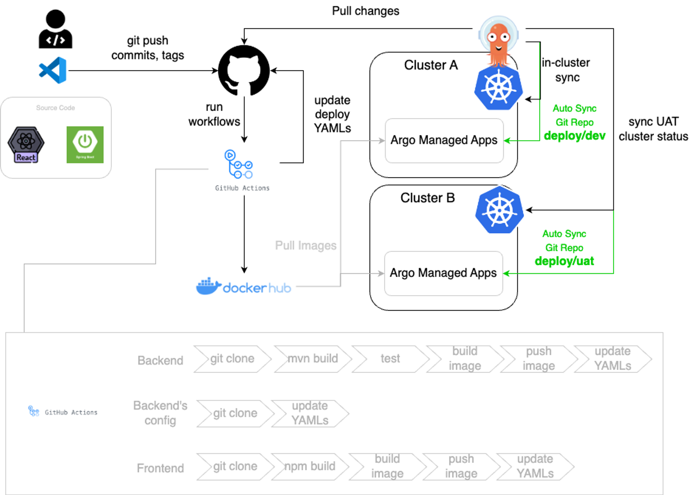

# Rancher、Github Actions 與 ArgoCD 實踐 K8s 敏捷開發 - 楊俊仁 (Danny)

tags: k8ssummit2023 k8s
內容規劃
本次工作分實作內容規劃如下

- 建立本地K8s開發環境，包含Rancher Desktop 與 Rancher ( 25 mins )
- GitHub Action CI 規劃與設計 ( 15 mins )
- 使用ArgoCD來實踐GitOps ( 20 mins )
- 透過前後端分離微服務專案來打穿整個敏捷開發流程 ( 30 mins )

工作坊簡報 : https://bit.ly/k8s23ppt

手把手實戰手冊 : https://bit.ly/k8s2023w

工作坊實戰藍圖

